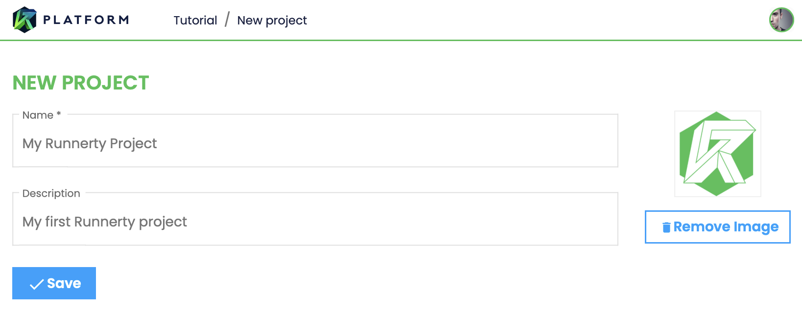
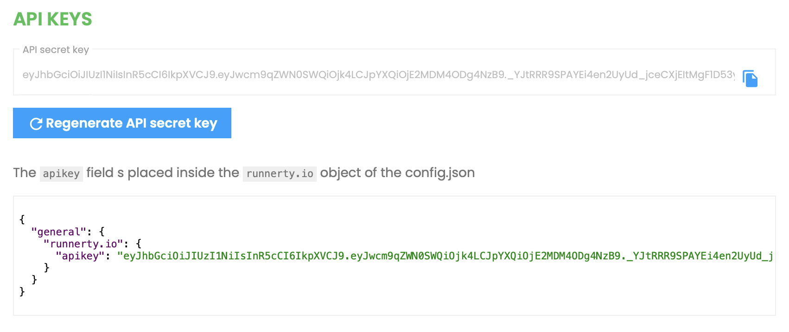
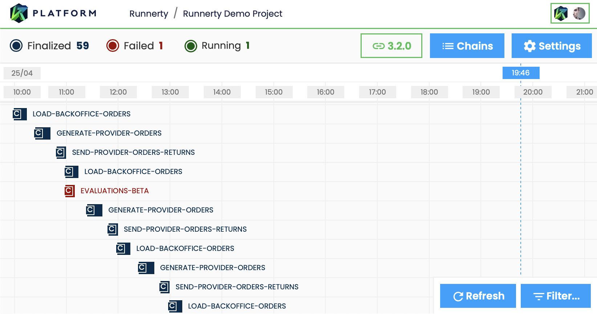
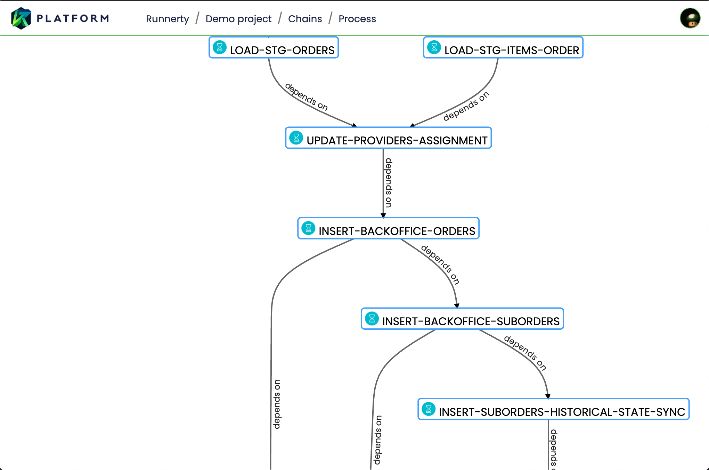

[Runnerty Platform](https://app.runnerty.io/) offers a platform to manage your runnerty projects, visualize your chains and processes in real time and much more.

#### 1. Access [Runnerty Platform](https://app.runnerty.io/) and create your project:



#### 2. Get your project's API Key:



```json {4} title="Enter the API Key in the configuration file of your runnerty project (config.json)"
{
  "general": {
    "runnerty.io": {
      "apikey": "YOUR_APIKEY_HERE!"
    }
  }
}
```

#### 3. Enjoy Runnerty Platform

In the next start of your project you will be able to visualize and control your processes and chains from Runnerty Platform.

🎉🎉 Congratulations, you are know connected to Runnerty Platform!

You can now visualize your executions



And your chains definitions



### Runnerty.io Parameters

| Parameter     | Default                  | Description                                                               |
| :------------ | :----------------------- | :------------------------------------------------------------------------ |
| disable       | false                    | disable Runnerty Platform connection                                      |
| host          | ws-telemetry.runnerty.io | Runnerty Platform enpoint                                                 |
| healthChecker | true                     | enables health signal communication                                       |
| remoteControl | true                     | enable remote control from Runnerty platform                              |
| debug         | false                    | enables the debug mode of the communication module (for development only) |

#### Chain configuration

```json title="You can also apply specific settings for a chain"
{
  "id": "CHAIN_SAMPLE",
  "name": "CHAIN SAMPLE",
  "runnerty.io": {
    "remoteControl": false,
    "sync": {
      "events": true,
      "chain": false
    }
  }
}
```

| Parameter     | Default | Description                                                                                    |
| :------------ | :------ | :--------------------------------------------------------------------------------------------- |
| remoteControl | true    | enable remote control from Runnerty platform                                                   |
| sync/events   | true    | enable the sending of information about events at runtime to allow its query from the platform |
| sync/chain    | true    | enable the sending the source code of your chain to allow its query from the platform          |
